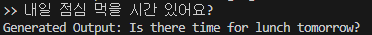

# Translation AI Model

## Overview

This AI model is designed for translating text between two languages using a transformer-based approach, specifically the KoBART model. The model has been trained on a JSONL dataset where each entry contains the original text and its corresponding translation.

## Dataset Format

The dataset is expected to be in JSONL format, with each line representing a dictionary. Each dictionary should have two keys:

- `text`: The original text to be translated.
- `tran`: The translated text corresponding to `text`.

### Example

```json
{"text": "Hello, how are you?", "tran": "안녕하세요, 어떻게 지내세요?"}
{"text": "Thank you.", "tran": "감사합니다."}
```

## Model Architecture and Training

The model architecture and training process are straightforward and well-documented in the code. Below are the key components:

1. **Custom Dataset Class**: `TranslationDataset` is defined to handle the JSONL data format and tokenize the text using KoBART's tokenizer.

2. **Data Loading**: The `load_data` function reads the dataset file line by line, loading the text and translation pairs.

3. **Data Splitting**: The data is split into training, validation, and test sets using the `random_split` function, with default ratios of 80% for training, 10% for validation, and 10% for testing.

4. **Training Components**:
   - **Model**: The KoBART model, `BartForConditionalGeneration`, is used for sequence-to-sequence translation.
   - **Optimizer**: `AdamW` with learning rate decay and gradient clipping.
   - **Scheduler**: Linear warm-up scheduler to gradually increase the learning rate at the beginning of training.
   - **Early Stopping**: A custom `EarlyStopping` class is implemented to monitor validation loss and stop training when performance plateaus.

5. **Evaluation**:
   - Validation and test accuracy are calculated based on the match between predictions and targets.
   - ROUGE scores are used to evaluate translation quality, with scores computed for ROUGE-1, ROUGE-2, and ROUGE-L metrics.

6. **Checkpoints**: The `save_checkpoint` and `load_checkpoint` functions handle saving and loading model checkpoints. This allows for resuming training from the last saved state if interrupted.

7. **Training Loop**: The `train_model` function defines the main training loop, performing training and validation for each epoch. The model’s final performance is evaluated on the test set.

## Running the Model

To train the model, execute the following function:

```python
train_model(data_path="path/to/your/data.jsonl")
```

## Test the Model file

To test the trained translation model, you can run the `predict.py` file and enter text.

### Test the Model Example


## License

This project is licensed under the [MIT License](./LICENSE).